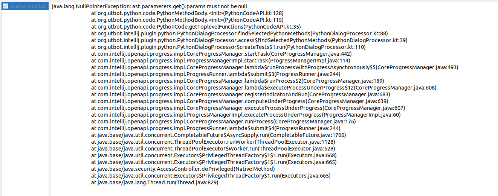

# UTBot-Python Testing: Synthetic Examples

This file contains identified problems when running UTBot-Python for synthetic examples located in the `synthetic`
directory.

## Fuzzing

### `fuzzing_tests.py`

* Cannot collect `10` and `-5` constant values from `check_constants_if_cases` function body. Perhaps because they are 
  next to the inequality operators, not the equality operators.
* Failed to generate tests for:
  * ```python
    def check_complicated_constants(x: int = 5) -> str:
        ...
    ```
    Possible reason: parameter's default value. If removed, test generation succeeds. In addition, ***support for functions
    with parameters with default values*** is very necessary: in Python, such a language feature is used catastrophically 
    often. 
  * ```python
    def check_complex_constants(x: complex) -> str:
        if x > complex(5, 5):
            return "> 5 + 5i"
        return "<= 5 + 5i"
    ```
* Cannot collect some complicated constants values for fuzzing from `check_complicated_constants` body. For example:
  `two_str = "2"` and `fours_list = [4, -4]`.

## Type inference

### `fully_annotated.py`

Throws an exception after confirming test generation in the dialog window.



After that, UTBot-Python completely broke down and stopped responding to confirmation of new dialog windows: they just 
closed without a trace. Maybe Intellij IDEA just didn't duplicate the same exceptions.

### `partially_annotated.py`, `no_annotations.py`

After a startup error on `fully_annotated.py` (see details in the section above), they also just silently closed the 
dialog after confirmation for test generation.

### `bad_functions.py`

Failed to generate tests, but it was as expected. However, it might be better to see some description of the cause of 
the error.

### `strangely_annotated.py`

Failed to generate tests for:
* ```python
  def add(x: 'int', y: 'int') -> 'int':
      return x + y
  ```
* ```python
  def call_len_with_fully_quoted_annotation(x: 'List[int]') -> 'int':
      return len(x)
  ```
* ```python
  class Dummy:
      def __init__(self, x: 'int'):
          self.x = x
    
  def inc_dummy(d: Dummy) -> int:
      d.x += 1
      return d.x
  ```
Possible reason is as expected: quoted types. However, it is important to note that in other cases, UTBot-Python has 
done well, namely for:
* ```python
  def call_len_with_partially_quoted_annotation(x: List['int']) -> 'int':
      return len(x)
  ```
* ```python
  class DummyWithMethodsToTest:
      def __init__(self, x: int):
          self.x = x
  
  def inc_by_with_future_annotation(self, other: DummyWithMethodsToTest) -> int:
      self.x += other.x
      return self.x
  ```

## Functional

_**TODO**_