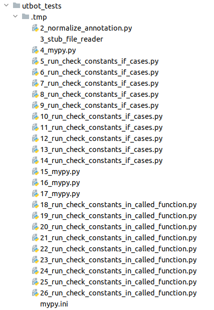
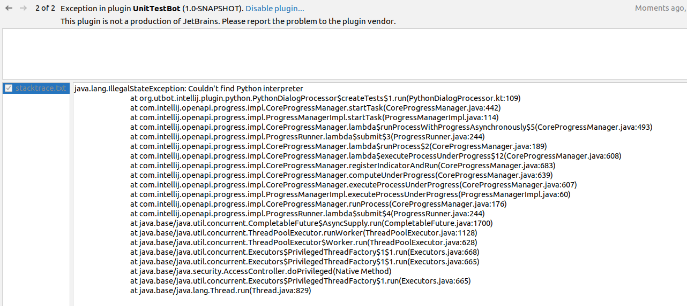
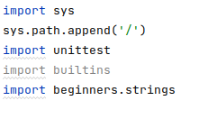
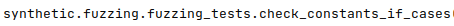
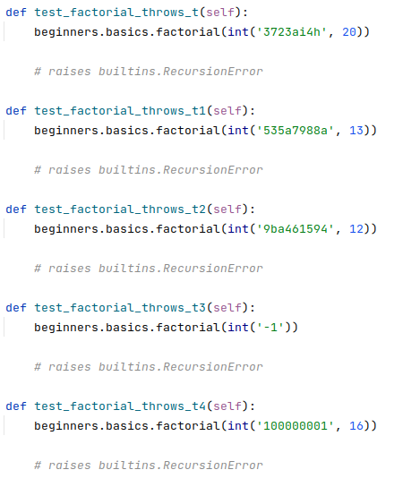
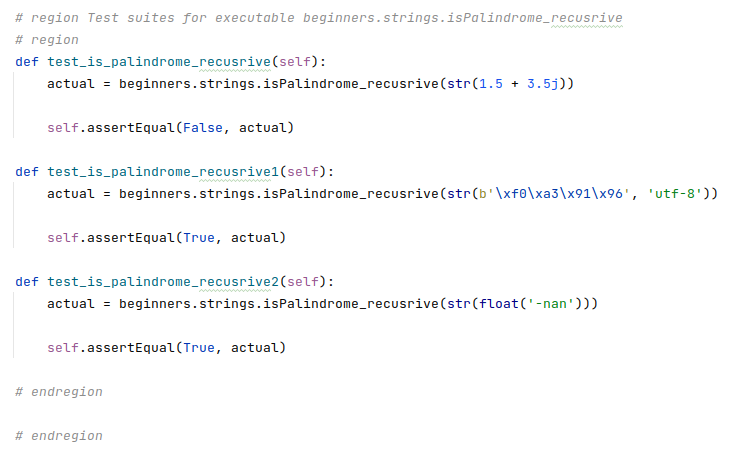
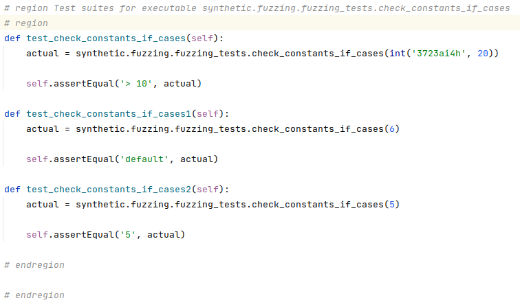
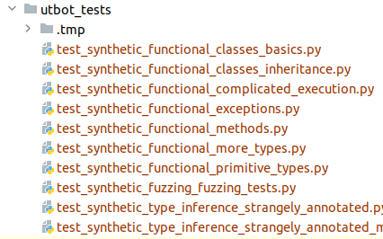
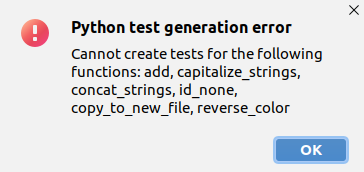

# UTBot-Python Testing: User Experience

This file contains the identified inconveniences when using the UTBot-Python plugin for Intellij IDEA by the user. In
addition, common comments (relevant for all projects) on the work of the plugin are also collected here.

## Intellij IDEA experience

### Installing dependencies resets the window

If there are no dependencies necessary for the plugin to work, a window pops up asking you to install them. After
clicking on `Yes` and a successful installation, nothing happens: neither an alert window, nor the generation of tests
that the user has previously selected.

### Cursor at the end of the last line does not trigger the selection of this function

According to the logic of the plugin, if the cursor is inside the function body, then this function will be selected in
the window that appears by default. Therefore, when the user wants to deliberately select one function, he puts the
cursor in its body: often right at the very end of the last line. However, unfortunately, in this case all functions in
the file will be selected, which is inconvenient.

### Intellij IDEA shows temporary files

Temporary files that UTBot-Python generates in large quantities during operation have time to be displayed in Intellij
IDEA, which can frighten the user. They disappear only after some time or reloading the directory.

Moreover, the `.tmp` directory itself is never deleted.

### Exception raises if Python SDK is not set

If the user has not set the Python SDK, but confirms the generation of tests in the UTBot window, an exception is
thrown.

### Missing validation of an empty list of selected functions or methods

In the dialog window, when selecting target functions or methods for generating tests, the user can choose none and
start the generation process. Unfortunately, UTBot will start doing some useful work, judging by the indicator and
generated temporary files. It would be better to add a check for this.

## Generated tests experience

### Unused imports in generated files

It is very common to find unused imports (but not many) in the generated files: they cause warnings, which may be
unacceptable or undesirable for some users. Examples for `synthetic` tests:

* `import types` in:
    * `test_synthetic_functional_classes_basics.py`
    * `test_synthetic_functional_classes_inheritance.py`
    * `test_synthetic_functional_complicated_execution.py`
    * `test_synthetic_functional_methods.py`
    * `test_synthetic_type_inference_strangely_annotated_methods.py`
* `import builtins` in:
    * `test_synthetic_functional_complicated_execution.py`
    * `test_synthetic_functional_exceptions.py`
    * `test_synthetic_functional_primitive_types.py`
    * `test_synthetic_fuzzing_fuzzing_tests.py`
    * `test_synthetic_type_inference_strangely_annotated.py`
    * `test_synthetic_type_inference_strangely_annotated_methods.py`

### `sys.path.append` command causes multiple warnings

In the generated files, the user may often encounter the `sys.path.append` command among the imports. Since it is above
some of them, Intellij IDEA displays a lot of warnings.

### Full qualified names of objects make tests much less readable

In the generated files, all references to functions and classes are made by fully qualified names: namely, by specifying
all packages. Given that there can be many packages in a Python project structure, this makes the tests much less
readable. Is it possible to get rid of this problem with the help of imports?

### User-unfriendly values are generated for primitive types

For example, values for `int` and `str` types are generated in a very unnatural way for Python language: this makes
understanding the tests very inconvenient, especially for beginners.

### Perhaps extra "regions" in code generation

In all generated files, the beginning and end of the "region" comments are duplicated.

### Too long lines in generated files

Periodically, in the generated files, the lines turn out to be catastrophically long. Perhaps it will help to
automatically format the generated files?

For example: line #72 in `test_synthetic_functional_classes_basics.py` (constructing object of
class `synthetic.functional.classes_basics.UsersDB`).

### Unable to generate test files for both top level functions and methods

To generate tests for top-level functions, the user needs to set the cursor outside of any class. To generate tests for
class methods &mdash; vice versa. However, in both cases the generated file will have the same name: because of this,
getting both files with tests of top-level functions and methods at the same time is impossible, one of them will be
overwritten. File naming needs to be improved.

### Need directories instead of long generated filenames

The current strategy for naming generated files is to combine the names of the packages containing the original file and
its name into one string. However, in this case, there is no structure in the folder with the generated tests, which can
be inconvenient in large projects. Perhaps creating a directory structure similar to the original will solve the
problem?

### Lack of explanation of the reason of a test generation error

The user can often get a test generation error message. At the same time, as it became clear during testing, errors can
be very different: associated with unsupported language constructs (such as optional function parameters), too long
execution of a function, or failures in type inference. Due to the wide variety of reasons, the user will not be able to
find out what exactly went wrong, and will try to, perhaps pointless, restart the generation again, write to the
developers or correct the function code. Describing the cause of the error can save the user this effort.

